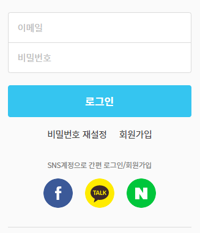

# :innocent:

# OAuth2

스프링을 공부하다보면, 파면 팔수록 공부할게 많아진다.

시큐리티를 공부하니 AOP개념이 나오고, AOP를 공부하니 OAuth2개념이나오고...
아직은 공부할것이 매우 많다.

그 중 하나가 OAuth2... 나는 JWT를 먼저 접한 입장으로서
OAuth2를 아직 공부를 안한 상태로 글을 작성한다.

JWT로 인증이 되고, 변조도 못한다면, OAuth는 왜 필요할까?

****

## OAuth2 개요

1. 오픈 아이디는 표준스펙이 미존재
2. 제공자마다 서로 다른 프로토콜 제공
3. 규격별 연동이 필요
4. **프로토콜 보안 이슈**
5. OAuth 1.0 발표
6. 브라우저에 국한 된 한계점
7. 이를 극복한 OAuth 2.0 발표
   (그렇다고 OAuth 1.0이 좋지 않다는 의미는 아님)

간략적인 ~~내가 이해한~~ 개발 배경과 흐름이다.

## OAuth2.. 왜써야해?

github를 이용하려면, Git cli를 사용해서 형상관리를 한다.

하지만 더 편리한 SourceTree와 다른 프로그램들이 많다.
예를 들어 SourceTree라고 하자.

1. 사용자가 Github ID와 PW를 입력하여 SoruceTree에서 Git을 이용해 프로젝트 형상관리를 한다.
2. SourceTree는 해당 ID와 PW를 이용하여, Github에 접속한다.
3. Github는 해당 계정이 접근할 수 있는 서비스를 제공한다

매우 깔끔한 것 처럼 보이지만, 문제점이 여러개가 있다.

1. 사용자는 ID와 PW를 노출시켰다(Github가 아닌 3자 프로그램에게)
2. SourceTree는 사용자의 ID와 PW를 보관하고 있다.
3. Github는 사용자가 접근한 것 인지, 프로그램이 접근한 것인지 구분하지못한다

이러한 문제점은 바로 취약점을 노리는 사람들에게 직결된다.

사용자는 자신의 계정이 노출되어서 문제,
SourceTree는 사용자의 계정을 잘 보관해야해서 문제, 
Github는 악의적 접근인지 구분해야해서 문제이다.

이러한 문제점을 극복하기 위해 모두가 공유하는 인증방식을 사용하게된다.

최근에 계정연동을 이용한 로그인이 많다.

이러한 모습을 볼 수 있는데, 이는 직접적인 로그인으로 kakao, facebook, naver에 로그인이후
해당 사이트에서 OAuth2를 전달받는 것으로 생각된다. (아직 공부중이라 정확하진 않습니다 ㅠㅠ)

이렇게 된다면, 유저는 계정을 해당 사이트에만 노출을 시켰고, 서비스를 제공하는 회사는 토큰을 발급후,
해당 프로그램이 갖고있는 토큰으로 저장만 해놓는 것이다.

이렇게 된다면, 서비스 제공자는 프로그램에서 로그인을 알아챌 수 있고,
사용자는 모르는 토큰(프로그램)이라면, 토큰 삭제를 통해 보안을 유지할 수 있으며,
프로그램 개발자는 단순히 토큰만 잘 보관하면 된다는 뜻이 된다.

## 그래? 그럼 어떻게 쓰는데?

[OAuth 개발 페이지](https://oauth.net/code)

위 페이지를 확인하면, 지원하는 언어들이 나온다

개발자가 아니어도 한번쯤은 들어본것들이 매우 많다.
위 페이지에서 확인할 수 있는 언어들을 모두 모듈로 지원하는것이다.

아직은 공부해야 할것이 많다 ㅠㅠ...